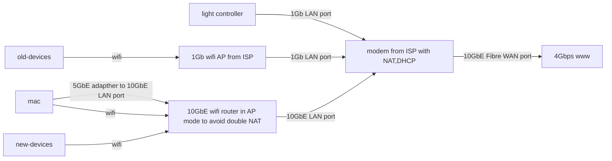

# Architecture

## Networking

```mermaid
flowchart LR
    modem[modem from ISP with NAT,DHCP] -->|10GbE Fibre WAN port| 4gbpswww[4Gbps www]

    light-controller[light controller] -->|1Gb LAN port| modem

    1gbwifi[1Gb wifi AP from ISP] -->|1Gb LAN port| modem
    old-devices -->|wifi| 1gbwifi

    10gbewifirouter[10GbE wifi router in AP mode to avoid double NAT] -->|10GbE LAN port| modem
    mac -->|5GbE adapther to 10GbE LAN port| 10gbewifirouter
    mac -->|wifi| 10gbewifirouter
    new-devices -->|wifi| 10gbewifirouter
```
